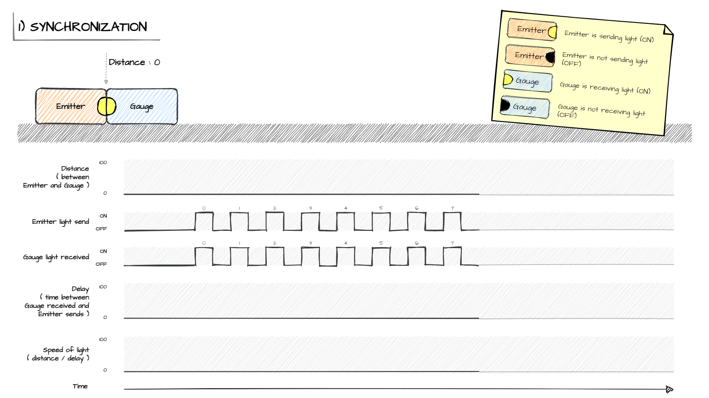
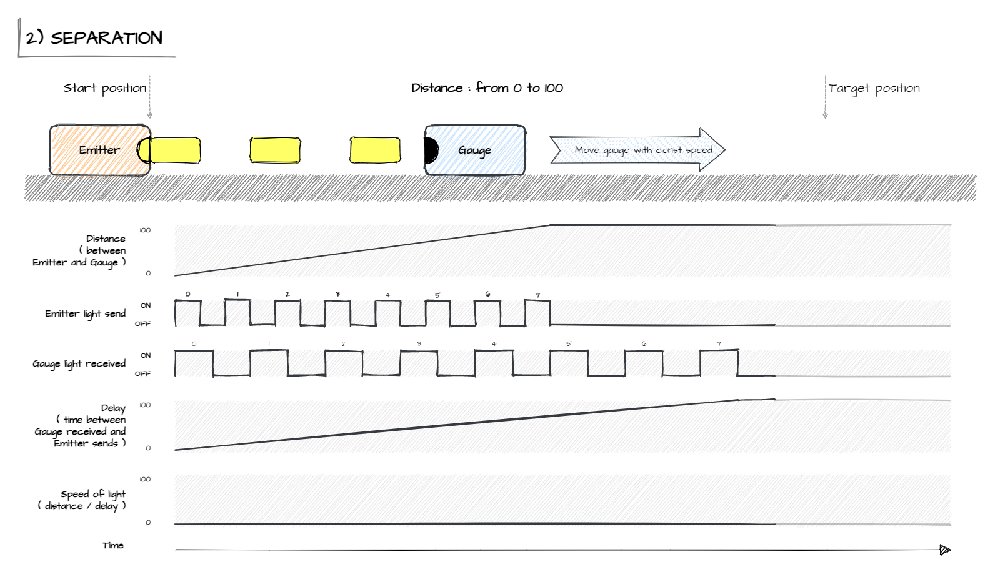
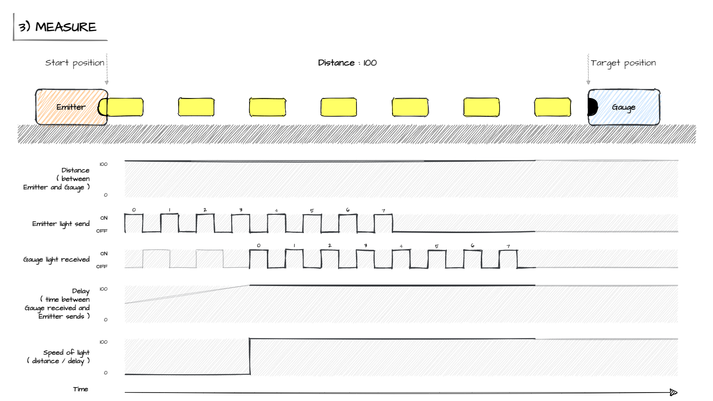

# Theoretical explanation of how to measure the speed of light in one way

## Problem explanation

Problem of measuring speed of light in one direction is describe in:

- [en.wikipedia.org/wiki/One-way_speed_of_light](https://en.wikipedia.org/wiki/One-way_speed_of_light)
- [YT: Veritasium: "Why The Speed Of Light* Can't Be Measured"](https://www.youtube.com/watch?v=pTn6Ewhb27k)

**In short:**  
Main trouble of on way measuring is synchronization two clocks/timers.  
Source timer and detector timer cannot be started at exactly same time.

## Solution - theoretical explanation

Idea to solve this problem is based on continuous broadcasting light flashes.  
In this approach speed of light is not calculated by one measurment but by series of measurments.

Measurement must be divided into 3 steps:

1. Synchronization
2. Separation
3. Measure

### 1. Synchronization

In this step Emitter (as source of light) and Gauge (detector of light) are connected.  
Distance between them is equal 0.  

It can be assumed that light is released from Emitter and received by Gauge is the same time.

Emitter is resposible for sending light as signal with two states: ON / OFF.  
Time of light ON and time of light OFF is permanent.  
Both times are set in Emitter and can be set in Gauge.  

In Synchronization Emitter is sending light signals and Gauge is adapting.  
By this process Emitter "metronome" and Gauge "metronome" are synchronized.

Delay between releasing light and receiving should be equal 0.

### 2. Separation

After synchronization, Gauge can be disconnected from Emitter.  
In this step Gauge is moving in one direction to target position - away from Emitter.  
Movement can be done slowly or fast.

During this porcess Emitter is constantly sending light signals (ON/OFF) - according to Emitter "metronome".

Gauge "metronome" is permanently running and Gauge known when light signal (ON/OFF) was released and known when light signal (ON/OFF) was received.

Difference between time send and time received is named as delay.

Delay is increasing because distance is increasing.
After reaching target position, delay is constant.

### 3. Measure

After separation, Gauge can measure speed of light.

Emitter is still constantly sending light signals (ON/OFF) - according to Emitter "metronome".  
Gauge is still receiving signals ON/OFF but with constant delay.

## Additional informations

### Author

Mateusz Skafiriak

### Timeline

2022-02-05 - Document added: "Theoretical explanation of how to measure the speed of light in one way" 
2022-02-04 - web aplication : finished
2022-01-11 - web aplication: git init and first commit  
2022-01-09 - watched Veritasium video  

### Licence

This work is licensed under the Creative Commons Attribution-NonCommercial-ShareAlike 4.0 International License. To view a copy of this license, visit http://creativecommons.org/licenses/by-nc-sa/4.0/ or send a letter to Creative Commons, PO Box 1866, Mountain View, CA 94042, USA.